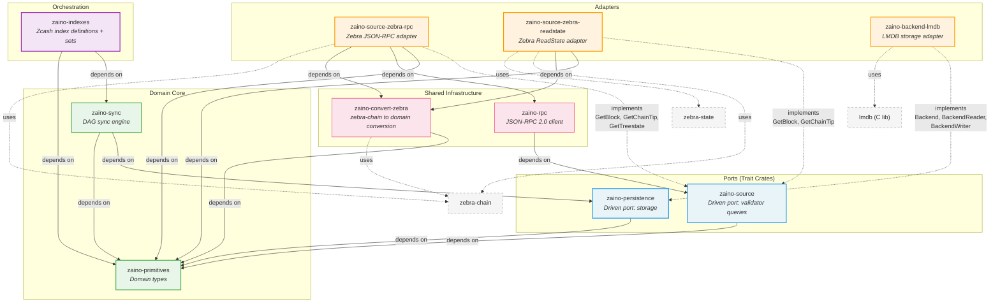

## Crate Architecture

The sync engine follows a hexagonal (ports-and-adapters) architecture.
Domain core crates define business logic with no external dependencies.
Port crates declare trait interfaces. Adapter crates implement those
traits against concrete infrastructure. Orchestration wires indexes
together. Shared infrastructure provides cross-cutting utilities.

### Crate Summary

| Crate | Layer | Role | Implements |
|-------|-------|------|------------|
| `zaino-primitives` | Domain Core | Zcash domain types: `Block`, `BlockHeader`, `Transaction`, `Height`, `BlockHash`, `TransactionHash`, `Zatoshis`, etc. Zero external dependencies beyond `thiserror`. | -- |
| `zaino-sync` | Domain Core | DAG-driven parallel sync engine. Defines the `IndexDef` trait hierarchy (scope axis: `BlockLocal` / `SelfCumulative` / `CrossIndex`; composition axis: `Append` / `Monoidal` / `Fold`), the `Schema` trait for persistence encoding, scheduler, block buffer, and pipeline. Generic -- contains no blockchain knowledge. | -- |
| `zaino-source` | Port (Driven) | One trait per validator query: `GetBlock`, `GetChainTip`, `GetBestBlockHeight`, `GetTransaction`, `GetBlockByHash`, `GetBlockVerbose`, `GetTreestate`, `GetAddressBalance`, `GetAddressDeltas`, `GetAddressTxids`, `GetAddressUtxos`, `GetMempoolTxids`, `GetSubtreeRoots`, `GetCommitmentTreeRoots`. Also provides `Resilient` wrapper and `RetryPolicy`. | -- |
| `zaino-persistence` | Port (Driven) | Storage abstraction: `Backend` (open reader/writer/flush), `BackendReader` (get/scan by namespace), `BackendWriter` (atomic commit of `WriteOp` batches). Namespace-based keyspace organization. | -- |
| `zaino-source-zebra-rpc` | Adapter (Source) | Bridges `zaino-source` traits to Zebra's JSON-RPC endpoint. Uses `zaino-rpc` for transport and `zaino-convert-zebra` for type mapping. | `GetBlock`, `GetChainTip`, `GetTreestate` |
| `zaino-source-zebra-readstate` | Adapter (Source) | Bridges `zaino-source` traits to Zebra's finalized state DB via `zebra-state` `ReadStateService` (Tower). Direct DB reads -- no HTTP, no JSON. Orders of magnitude faster for bulk sync. | `GetBlock`, `GetChainTip` |
| `zaino-backend-lmdb` | Adapter (Persistence) | LMDB-backed storage. One named database per `Namespace`. Zero-copy reads via memory-mapped files. Atomic batch commits. `NO_SYNC` mode with explicit flush at batch boundaries. | `Backend`, `BackendReader`, `BackendWriter` |
| `zaino-indexes` | Orchestration | Zcash-specific index definitions (headers, txids, txid-location, hash-to-height, transparent-spends, transparent-data, sapling, orchard) and pre-composed index sets (headers-only, headers-and-spends, current-zaino). Each index implements `IndexDef` + extract + merge + `Schema`. Sets define `ProvideContext` projections and builder functions. | `IndexDef`, `Extract*`, `Merge*`, `Schema` |
| `zaino-rpc` | Shared Infra | JSON-RPC 2.0 client: HTTP transport, request/response envelope, retry on work-queue exhaustion, authentication. Returns raw `serde_json::Value` -- response parsing is the adapter's responsibility. | -- |
| `zaino-convert-zebra` | Shared Infra | Pure conversion functions: `zebra-chain` types to `zaino-primitives` domain types. `block_from_zebra`, `header_from_zebra`, `header_from_parts` entry points composing per-type converters. | -- |

### Dependency Flow

The dependency graph enforces the hexagonal architecture invariant:

- **Inward only**: adapters depend on ports, ports depend on domain core. Never the reverse.
- **No adapter-to-adapter**: source adapters and the persistence adapter are fully independent.
- **Engine is generic**: `zaino-sync` depends on `zaino-persistence` (the port), never on `zaino-backend-lmdb` (the adapter). It depends on `zaino-primitives` for `IndexId` only.
- **Orchestration is the composition root**: `zaino-indexes` depends on `zaino-sync` and `zaino-primitives` to define concrete Zcash indexes. The application entry point selects adapters and wires them together.
- **Conversion is infra, not domain**: `zaino-convert-zebra` depends on `zaino-primitives` (domain) and `zebra-chain` (external). It is used by source adapters, not by the engine.

---

- [Formal Model](formal-model.md)
- [Design Spec](design.md)
- [Implementation Spec](implementation.md)
- [User Stories](user-stories.md)
